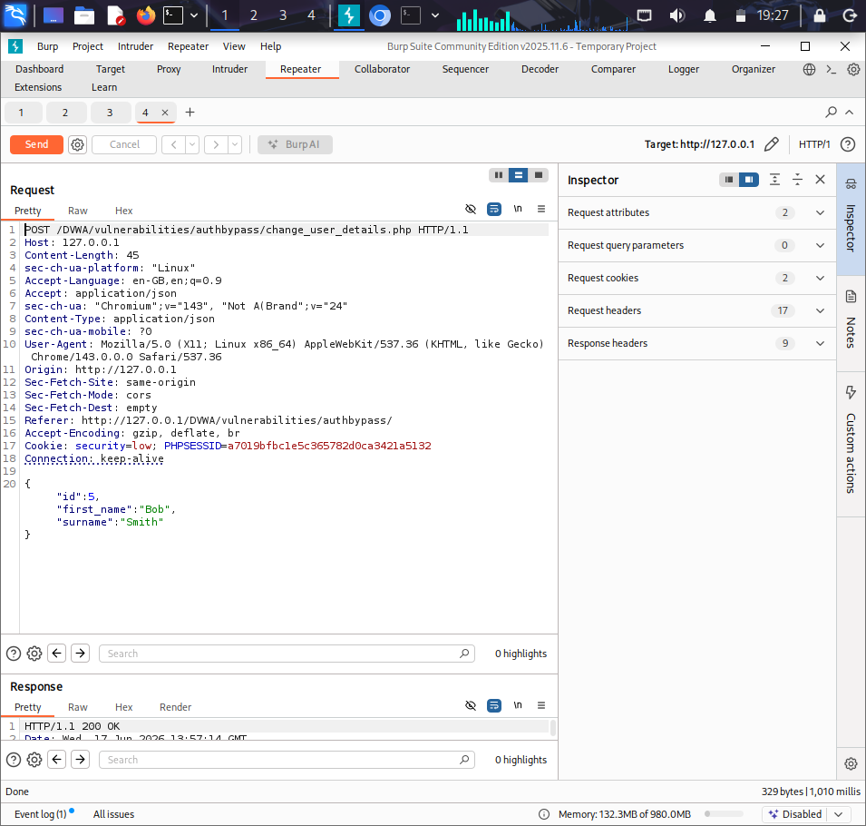
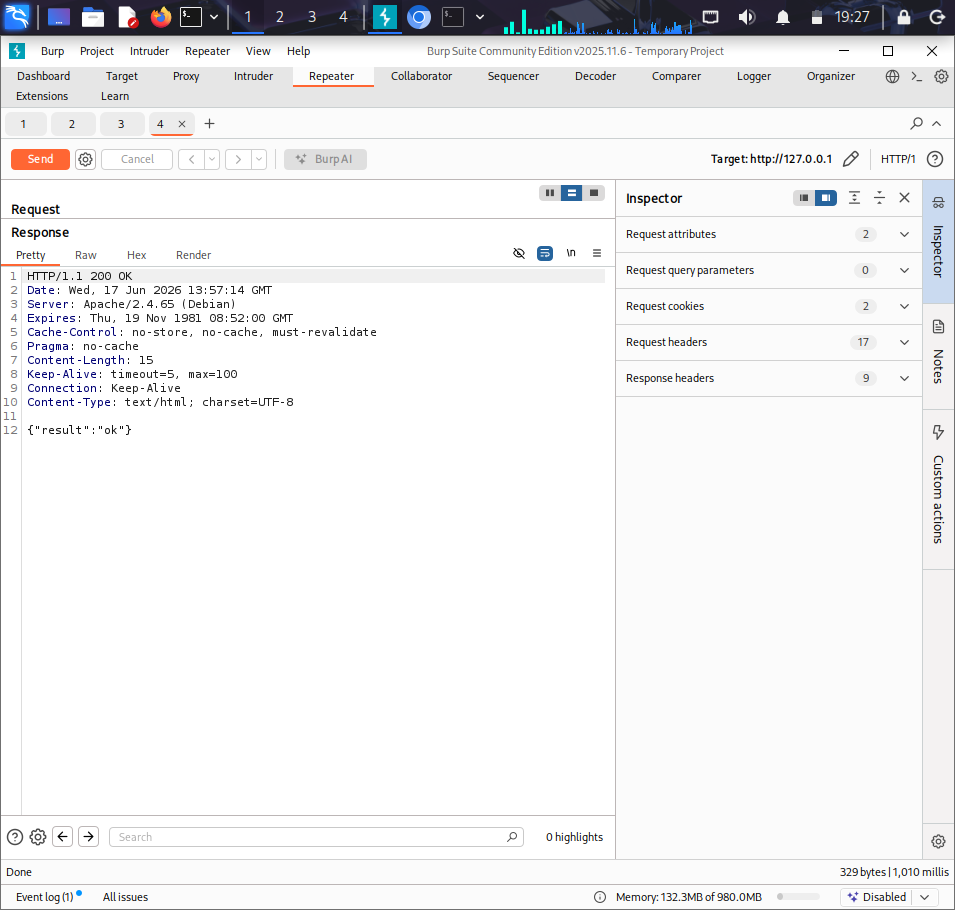
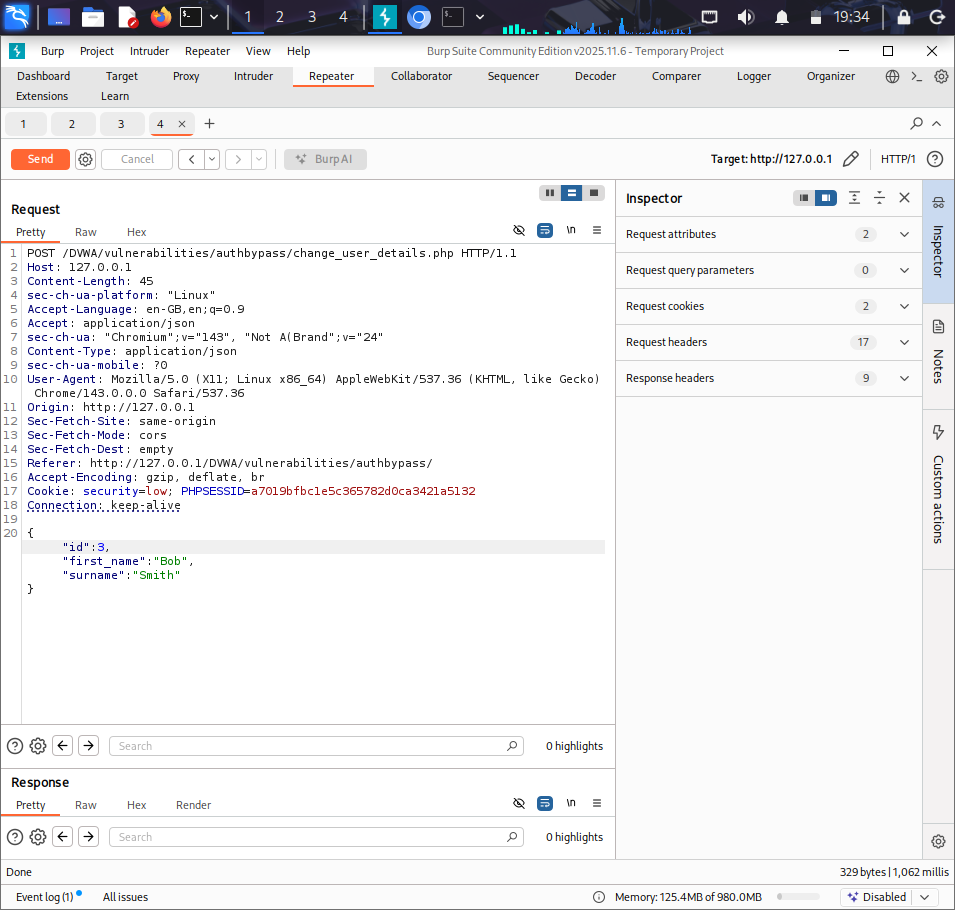
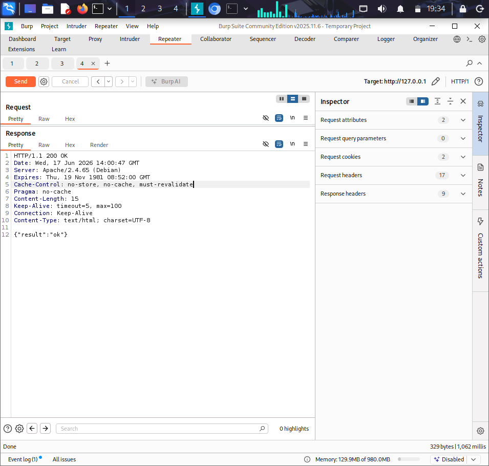
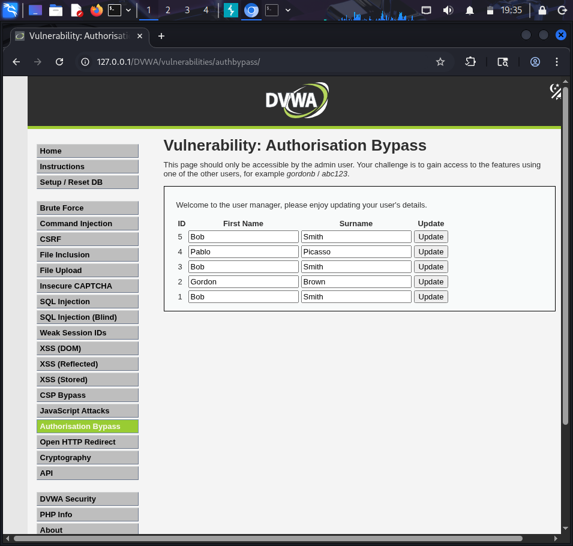

# Burp Suite Project 5 – Authorization Bypass Testing (IDOR)

## Overview

This project demonstrates an Authorization Bypass vulnerability in DVWA (Damn Vulnerable Web Application) using Burp Suite.

The objective was to evaluate whether the application properly validates user permissions before allowing modifications to user records.

By intercepting and modifying a user identifier in an HTTP request, it was possible to alter data belonging to another user without additional authorization checks.

---

## Objectives

- Capture and analyze HTTP requests using Burp Suite
- Identify user-controlled parameters
- Modify object identifiers in requests
- Evaluate authorization controls
- Verify whether unauthorized modifications are possible

---

## Tools Used

- Burp Suite Community Edition
- Kali Linux
- DVWA (Damn Vulnerable Web Application)

---

## Methodology

### Step 1 – Capture Request

A request responsible for updating user details was intercepted using Burp Suite.

Original Request:

```http
POST /DVWA/vulnerabilities/authbypass/change_user_details.php
```

Request Body:

```json
{"id":5,"first_name":"Bob","surname":"Smith"}
```

---

### Step 2 – Send to Repeater

The intercepted request was sent to Burp Repeater for testing.

---

### Step 3 – Modify Identifier

The user identifier was modified.

Original:

```json
{"id":5,"first_name":"Bob","surname":"Smith"}
```

Modified:

```json
{"id":3,"first_name":"Bob","surname":"Smith"}
```

---

### Step 4 – Submit Modified Request

The modified request was sent to the server through Burp Repeater.

Server Response:

```json
{"result":"ok"}
```

---

### Step 5 – Verify Changes

The DVWA page was refreshed and the changes were successfully applied to the record associated with the modified identifier.

---

## Key Findings

- The application accepted user identifiers supplied by the client.
- The user ID parameter could be modified using Burp Suite Repeater.
- The server processed modified requests successfully.
- Changes were applied to records belonging to other users.
- No authorization validation was observed when modifying identifiers.
- The application trusted client-controlled identifiers.

---

## Security Impact

An attacker could modify identifiers within requests and perform actions on records belonging to other users.

This vulnerability could result in:

- Unauthorized modification of user data
- Integrity violations
- Privilege abuse
- Unauthorized access to protected resources

---

## Screenshots

1. Original Request

2. Original Response

3. Modified Request

4. Modified Response

5. Updated User Data in DVWA


---

## Skills Demonstrated

- Authorization Testing
- IDOR Assessment
- Access Control Analysis
- Burp Repeater Usage
- HTTP Request Manipulation
- Vulnerability Validation
- Security Documentation

---

## Recommendations

- Enforce server-side authorization checks.
- Validate user ownership before processing requests.
- Avoid relying on client-supplied identifiers for access control decisions.
- Implement role-based access control mechanisms.
- Log and monitor unauthorized access attempts.

---

## Conclusion

This assessment successfully demonstrated an Authorization Bypass (IDOR) vulnerability within DVWA. By modifying a user identifier in a captured request, it was possible to update records belonging to another user. The application failed to perform proper authorization validation, allowing unauthorized actions to be completed successfully.
